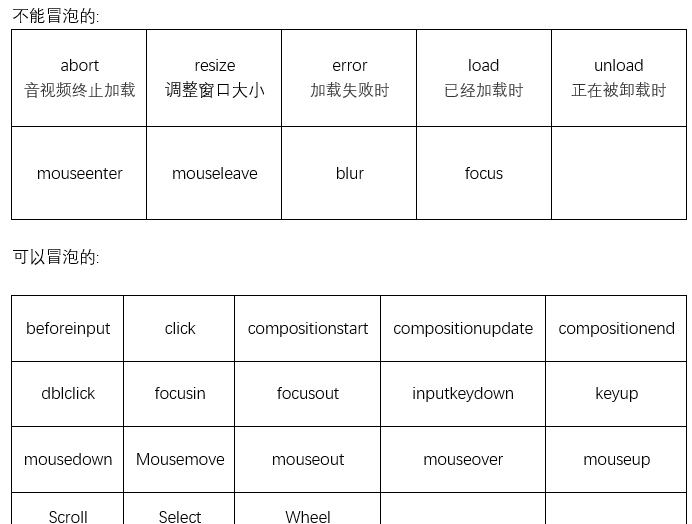

## mini-bitcask


#### gopath 和goroot的区别

goroot就是go的安装路径，gopath是go下载安装包的位置，可以有多个，第一个是默认位置

https://blog.csdn.net/qq_38151401/article/details/105729884


#### go111module

有时候下包总是会遇到网络连接超时的问题，可以通过设置go111module开启关闭状态来适应

https://blog.csdn.net/qq_39611230/article/details/121232707


项目似乎就是一个把增删改查作为数据信息状态就行更新，而不是直接物理删除或修改的功能。还有一个数据文件合并的操作，修改数据信息中的状态信息（put，del）之后文件中的数据条目很多，不方便检索。这样写操作是顺序io的，减少操作系统寻道


### rosedb

不同类型数据存在不同得文件类型中

写文件的方式

mmap

fileIO


内存中存储除了类似key value的形式 也会存储其他索引信息（key value size 偏移量 文件中的位置， 时间戳（过期时间）等等 这样就保证读取过程一次内存查找 一次磁盘查找 不会查找多余的文件

如果内存直接命中则会在内存中返回值

写操作是增删改都要向磁盘中添加一条记录，然后更新内存

读操作先在内存中找，然后依据key在磁盘中定位数据文件


而lsm是需要读取磁盘不同的sstable（文件block） 然后再去查找其中的数据 **读放大**

lsm是写内存，内存写满了memtable 再刷新到磁盘 这也导致了读放大问题 需要先读block 再读block中的entry

空间放大问题：在磁盘中会存放冗余的数据（过期的数据）


bicask是简化版的lsm

bitcask合并操作是把所有的entry取出，然后判断哪些是有效的，去除无效的 当文件数量多时需要合并 activate文件是不需要合并的

rosedb合并也是上面那样操作的 如何优化就是考虑对单个文件进行合并


### gnce

学习安装torch的时候，使用公共镜像，只需要配置一下cuda环境变量就可以了 cuda113 pytorch1.12.0

下面是一个丝滑小连招安装torch

~~~bash
pip install torch-scatter torch-sparse torch-cluster torch-spline-conv torch-geometric -f https://data.pyg.org/whl/torch-1.12.0+cu113.html
Looking in links: https://data.pyg.org/whl/torch-1.12.0+cu113.html
~~~


### cekai

黑盒测试：不清楚代码具体实现， 只知道输入输出

白盒测试：知道代码细节（单元测试）

灰盒测试：知道代码逻辑（接口测试）

**冒烟测试**就是完成一个新版本的开发后，对该版本最基本的功能进行测试，保证基本的功能和流程能走通。

**回归测试：**开发修复某个bug 需要对其他除bug以外的功能进行测试 

回归测试我有两层理解，一是就是当你修复一个bug后，把之前的测试用例再次应用到修复后的版本上进行测试。

二是当一个新版本开发好后，而且冒烟测试通过，此时可以先用上一个版本的测试用例对新版本进行测试，看是否有bug！其实回归测试用的很多，比如新增加一个功能模块等等，所以自动化测试可以高效率的进行回归测试。

关于冒烟测试和回归测试的区别https://blog.csdn.net/kami_ochin_akane/article/details/109210746


单元测试 -> 继承测试 -> 系统测试 -> 验收测试（UAT测试 user acceptance test 产品经理 老板）->  α测试（内测 用户来公司测试开发在现场） ->  β测试（公测， 真实的用户现场）测试开发不在场 运行维护

敏捷开发模型：版本迭代 功能的改进和完善


自动化测试 ui测试（web app） 接口测试（测试工具） 服务端性能测试（压测工具 java jmeter 监控平台 持续集成 持续交付 能够自动化将测试结果反馈研发

jenkins是一种集成测试的工具 能够利用git 实现代码推送后自动拉取部署和测试（这部分就是看了一下 发现面试题都没有这部分要求）


ERP （enterprise resource planning 企业资源计划 公司内部的一个内容资源管理系统


手机开启热点 台式机pc搜索不到 后来把手机蓝牙和wifi都关了 可以搜索到了 然后连接成功


**α测试** 由最终用户和其他用户测试 开发人员在旁记录的用户进行测试

**β测试** 开发人员测试人员不在旁 无法控制的环境下进行测试 远程报告问题给开发


#### 测试优先级

要从覆盖率最高的开始 测试用例覆盖最高 可以有效检测逻辑错误和程序中的潜在问题

基本路径覆盖法的优点是它可以确保每一个程序语句至少被执行一次，从而提高了测试的覆盖率。然而，它的缺点是需要对程序的内部结构有深入的了解，因此在实际应用中可能需要花费较大的工作量。


2024年6月27日10点05分

测试用例要先写大纲，然后再细化，分模块写出来，细化的可以在测试过程中完善

标题：出现bug的功能+出现bug的操作+bug具体结果

步骤结果预期：bug的预期，添加bug截图，测试数据，日志截图


**数据驱动**实现意思是说 测试用例修改之后只需要修改对应的测试用例文件，而不需要修改测试代码 基于json文件实现

断言：判断预期结果和实际结果是否一致

config：配置文件可以为项目部署上线进行设置 例如文件路径 项目api等等


2024年7月17日15点50分

有效，无效等价类，边界值情况需要考虑

自动化测试脚本测试增删改查，只针对插入的数据改变 尽量不影响原本的数据 防止产生垃圾数据

根据需求性能测试

高并发 多个用户同时

弱压力 一段时间 多个用户同时

高频率测试 一段时间内多次点击


 

#### linux

发行版：centos Ubuntu redhat linux与应用软件的打包


2024年6月27日09点50分（第二天记录的 实际是昨天下午）


c端产品面向普通用户 注重用户体验

b端产品面向企业用户 注重业务 提升企业用户工作效率 偏理性

**钉钉的基本面是ToB，但又很要求用户体验**


项目名称 广西东原盛康后勤管理服务有限公司医疗照护系统

项目时间 2023年6月-2023年8月

项目描述：医疗业务 医护人员及病患 医疗机构 医院 病患 当下越来越多的老年人及病患需要照顾 而年轻人大多需要在外打拼不能够陪护 而提供的医疗服务 构建医疗照护系统 为医疗机构 医护人员 及病患提供一个高效的平台 提升病患的服务需求的及时性 医护人员的工作效率和收益 医疗机构的管理效率等等 进一步联合医院打造医疗机构 医院 居家的一体化 医疗照护平台。

该项目旨在构建一体化医疗照护平台，整合医院、家庭和医疗机构资源，提升医护人员效率、患者服务及时性和医疗机构管理水平，以满足老年人及病患的照护需求

项目职责 

需求分析，充分了解客户需求，收集，整理并提炼产品需求，输出产品需求文档；

设计照护系统技术方案及系统架构，根据需求文档， 确定项目的技术架构，协助进行个子系统的数据库设计、原型设计

制定项目实施方案，根据项目的具体情况制定项目开发计划，编写项目开发计划表

负责设计及撰写功能说明书、业务流程图、用户操作手册等文档


你们知道学计算机都会买一台游戏本 一般来说这种性能比较高的 但是游戏本特别厚而且很大 因为比较高性能很耗电 携带就不方便

每天晚上我都可以把笔记本装包里 对 这个手提包里 没想到把 要么说叫手提电脑 hold on hold on 注意 把电脑装手提包里 不带充电器 听懂掌声


2024年9月4日20点08分

**有效等价类**：对程序的规格说明（需求文档）来说是合理的，有意义的

无效等价类则反之

比如需求文档表示1-100的数输入

有效就是1-100，其他全为无效


可以在开发者控制面板获取接口信息


postman进行鉴权

可以先获取验证码 然后设置在postman的请求列表中authorization中

或者在postman全局设置中设置环境变量 保存设置的值


#### jmeter性能测试

1. 获取api信息后

2. 添加线程组 **这里不设置就是接口测试**

   添加http请求

   设置接口信息（请求方式 域名 接口路径 参数设置 post设置请求体

3. 添加http信息头管理器

4. 添加观察结果树

5. 进行接口测试

   执行请求

   查看返回信息并验证

6. 添加相应断言 设置要校验的字段 添加断言结果

7. 查看验证返回信息


并发测试

- 添加线程组

通俗的讲，一个线程组可以看做一个虚拟用户组，线程组中的每个线程都可以理解为一个虚拟用户。多个用户同时去执行相同的一批次任务。每个线程之间都是隔离的，互不影响的。一个线程的执行过程中，操作的变量，不会影响其他线程的变量值。

- 设置ramp-up ramp-up 用于设置启动所有线程所需要的时间

- 设置循环次数
- 例如50个用户抢票时不停刷新100次 **那么线程数设置为50 循环次数设置为100**

- 添加定时器

- 设置集合点  **当用户数量达到20个的时候再同时请求进行登录操作**

  （1）模拟用户的数量：即指定同时释放的线程数数量，若设置为0，等于设置为线程组中的线程数量；

  （2）超时时间：即超时多少毫秒后同时释放指定的线程数；如果设置为0，该定时器将会等待线程数达到了设置的线程数才释放，若没有达到设置的线程数会一直死等。如果大于0，那么如果超过超时时间中设置的最大等待时间后还没达到设置的线程数，Timer将不再等待，释放已到达的线程。

- 添加聚合报告

- 执行脚本

- 查看压测结果


**进程是操作系统资源分配的基本单位 线程是处理器任务调度和执行的基本单位**


postman解决数据依赖的问题

Tests中写js代码，将需依赖的字段添加到环境变量中

在env_add接口的Pre-request Script 中写js代码，把第一个接口拿到的参数赋值

再将project_id配置到Body中prj_id字段中


使用python实现解决数据依赖

使用getattr获取指定对象属性值

使用setattr设置环境变量


#### 自我描述

我是一个性格开朗 善于与人沟通交流的人 在生活中乐于助人，具有奉献精神，用于担当，工作中具有一定的责任感，具有团队精神，做事认真负责，不足之处是偶尔会钻牛角尖

我是一个性格开朗、善于沟通的人，工作中注重团队合作。在过往的项目和经历中，我通过积极的沟通协调，帮助同学解决了多次难题，确保了任务的顺利进行。同时，我也是一个有责任感的人，对工作认真负责，力求精益求精。虽然偶尔会有钻牛角尖的倾向，但会悉心听取他人的意见，不断改正和提高。


#### 自我介绍相关

之前面试联想测开一面的时候，开场自我介绍发挥不好，结束太快，面试官很惊讶，表示就结束了？特此总结一下自我介绍怎么写

报名序号：**202501052965**

各位老师好，感谢老师给我这次面试的机会。我叫郑晋斌，来自江西，就读于桂林电子科技大学信息安全学院，专业是软件工程专业。在校期间完成了学业上的任务，完成了一篇论文，目前是ccfc在投，同时(积极参与实验室的科研项目，提高自己的专业技能)也做过较多的研发项目，熟悉JavaScript，前端框架，进行了功能测试，并在此基础上，完成了使用selenium和jmeter，postman的前端页面和接口的测试，同时搭建了基于pytest，allure的接口自动化测试框架，接口信息采用数驱动的形式进行，多进程跑测。此外，本科期间担任班长，校级社团部长，负责社团的周年庆活动，组织参与学校志愿者招募活动，活动超过500人，被评为“优秀负责人”，研究生期间担任学院的研究生会主席团主席，参与负责了较多院校级文体类活动，包括校运会和各种球类比赛的的组织参与，获得优秀组织奖，举办校级五四杯气排球赛，获得校级一等奖，担任学院的研究生软件工程专业党支部支委，负责党建与平台的管理，被评为“优秀共产党员”，具有较强的学习能力，工作认真负责，具有责任心和团队精神，我的介绍完了，谢谢各位老师。


之前读研究生看脱口秀嘛，也是互联网产品经理，因为之前有很多厉害的脱口秀演员都是互联网产品经理出身，比如庞博，小罗，然后我就觉得互联网产品经理是真的很搞笑，我的意思是干互联网产品经理的人很搞笑，哈哈哈哈。

也可以做链上的问答项目


chrome内存爆了

更改了一下系统的虚拟内存 舒服了方法是ctrl + s搜索性能 然后选择选项卡高级 然后取消自动 然后自定义 设置高点就行


#### 简历内容

专业技能

熟悉软件测试理论，软件测试流程及测试用例设计方法，提交缺陷并进行Bug的跟踪和回归测试 

熟练linux下常用命令，能够进行测试环境搭建，能够使用Shell脚本实现自动化任务，熟悉日志分析 

熟悉python+Selenium的web自动化测试方案，能够开发自动化测试脚本 

熟悉fiddler抓包工具使用分析前后端问题，进行快速问题定位 

熟悉Jenkins+sonar持续集成自动打包，部署代码管理平台 

熟悉pytest+Request+Allure的自动化测试方案，能够搭建接口自动化测试框架，分析测试报告 

熟悉loadrunner，jmeter性能测试工具的使用，能够进行压力测试和性能分析


软通动力信息技术有限公司 2021年06月 - 2021年07月 

工作内容 

使用Selenium编写自动化测试脚本进行功能测试，使用浏览器工具（如BrowserStack）对主流浏览器进行测试。 

使用Postman进行API手动测试，编写JUnit测试用例，分析测试结果 

**junit测试main方法 断言啊assert 控制器等等**

利用Jenkins进行集成测试，使用缺陷跟踪工具JIRA，记录、管理和跟踪测试中发现的问题，生成测试报告


**jira缺陷跟踪工具，测试报告管理可以用excel，pingcode**

集成测试：构建确认 补丁确认 测试组提交 设计测试用例 测试代码 bug跟踪 点对点测试


智能校园服装租赁网站 2023年06月 - 2023年08月 

项目描述 

该项目是一个智能校园服装租赁网站，前端采用Vue框架，后端采用SpringBoot，MyBatis架构，该项目能够为各社团组 织开展活动或文艺晚会提供服装租赁便携平台，同时提供对服装搭配的个性化问答

基于项目需求文档，设计测试方案和编写测试用例

使用Selieum+python，实现web端UI自动化测试，采用对页面元素封装实现数据驱动

根据接口文档，编写接口测试用例，使用Postman，Apifox进行接口测试

使用Pytest+Request+Allure搭建接口自动化测试框架，编写测试用例，生成测试报告

使用Jmeter，Postman进行接口测试和性能测试，分析和查看测试结果


**解决sql注入攻击 采用sql注入过滤 将一些正则表达式的符号进行过滤**


这个项目是一个基于 pytest 和 allure 的自动化测试框架，用于测试通用后端接口

使用 pytest 作为测试框架，编写测试用例，并使用 allure 生成详细的测试报告。

设计多环境运行，通过命令行进行传参区分

动态生成测试用例，支持多进程并行执行

参数化数据驱动，实现自动化的测试数据解析、请求发送和响应断言

集成 MySQL 和 Redis，用于测试数据库和缓存操作，确保多进程环境下的资源共享和数据一致性。

缺陷管理工具JIRA

学生干部内容可以在自我介绍说一下


#### GROUP BY

可以按某一列或几列对结果进行分组，可以在select后面接聚合函数，count，max， min等

HAVING子句

HAVING子句可以筛选通过GROUP BY分组后的各组数据，

~~~sql
mysql> select camp,MIN(register_time) as register_time from roles group by camp HAVING register_time > '2018-12-01 00:00:00';
+-------+---------------------+
| camp  | register_time       |
+-------+---------------------+
| horde | 2018-12-01 16:11:28 |
+-------+---------------------+
1 row in set (0.00 sec)
 
mysql> 
~~~

上述语句中HAVING的对象register_time，实际上是前面聚合函数MIN(register_time)的结果集。而由于WHERE子句不能包含聚合函数，所以此处只能使用HAVING子句

HAVING与WHERE的区别：

WHERE子句的作用：在对**查询结果进行分组前**，把不符合WHERE条件的行去掉，即在分组之前过滤数据。另外，WHERE条件中不能包含聚合函数；
HAVING子句的作用：筛选满足条件的组，即在**分组后过滤数据**，条件中**经常包含聚合函数**，使用HAVING条件过滤出特定的组。


在MYSQL中使用GROUP BY对表中的数据进行分组时，
GROUP BY X意思是将所有具有相同X字段值的记录放到一个分组里，
GROUP BY X, Y意思是将所有具有相同X字段值和Y字段值的记录放到一个分组里。

结果表现就是输出有几个列

#### tls握手过程

开始加密通信之前，客户端和服务器首先必须建立连接和交换参数，这个过程叫做握手（handshake）。

假定客户端叫做爱丽丝，服务器叫做鲍勃。

第一步，爱丽丝给出协议版本号、一个客户端生成的随机数（Client random），以及客户端支持的加密方法。

第二步，鲍勃确认双方使用的加密方法，并给出数字证书、以及一个服务器生成的随机数（Server random）。

第三步，爱丽丝确认数字证书有效，然后生成一个新的随机数（Premaster secret），并使用数字证书中的公钥，加密这个随机数，发给鲍勃。

第四步，鲍勃使用自己的私钥，获取爱丽丝发来的随机数（即Premaster secret）。

第五步，爱丽丝和鲍勃根据约定的加密方法，使用前面的三个随机数，生成"对话密钥"（session key），用来加密接下来的整个对话过程。


#### 正交法设计测试用例方法：

首先确定因素数量，影响实验结果的变量，控件的数量

然后确定水平数，就是每个因素的可取值

然后查找正交表 选择行数最小的填入数值

比如一个包含三个输入框的窗口测试


> 这是个人信息查询系统中的一个窗口。我们可以看到要测试的控件有 3 个：姓名、身份证号码、手机号码，也就是要考虑的因素有三个；而每个因素里的状态有两个：填与不填。
>
> 选择正交表时分析一下：
>
> 1、表中的因素数>=3；
>
> 2、表中至少有 3 个因素数的水平数>=2；  意思是上面有三个控件，每个控件有连个状态可选，所以选择正交表要至少包含上述条件
>
> 3、行数取最少的一个。


**边界值法**

取一组不符合的临界值，然后取一组符合的边界值

例如1 < x < 10 边界值取值 1 10 2 9

1 < x <= 10 取值 1， 11， 2， 10

1 <= x <= 10 取值0 11 1 10


#### 兼容性测试

**端兼容性APP**

从项目的使用环境考虑APP端

硬件兼容性：不同的手机厂商和型号上，使用一些云测试平台进行测试TestIn, WeTest等，测试APP安装卸载运行情况

操作系统兼容性测试：ios选择不同的系统，安卓进行挑选，使用模拟器或者真机进行测试，测试APP安装卸载运行情况

分辨率兼容性：覆盖市面上主流分辨率，屏幕尺寸，模拟器或真机，测试APP的界面显示、排版等各类UI测试

网络运营商兼容性：测试不同网络制，运营商，APP能正常工作 挑选网络请求的功能进行测试

与其他软件的兼容性：测试是否影响其他软件运行 或是安装卸载影响，或者其他软件影响当前APP


**web兼容性**


> 兼容性测试包括以下6个方面：1、浏览器兼容性测试；Browserling
>
> 网址：[https://www.browserling.com/] 云平台 lambda Test等测试工具进行浏览器
>
> 选择不同的浏览器和系统版本号，然后输入url进行常规的功能测试，自动化测试
>
> 2、操作系统兼容性测试；
>
> 3、数据兼容性测试；  数据在不同的存储和不同的格式的情况下
>
> 4、分辨率兼容性测试；
>
> 5、应用软件兼容性测试；
>
> 6、硬件兼容性测试。
>
> 其中，浏览器兼容性测试是需要在不同浏览器上检查Web页面显示以及交互共享运行等是否正常。

瞬时并发测试 可以使用jmeter 设置sync timer集合点 当到达多少个线程时再启动


#### **LoadRunner**

**什么是吞吐量**

客户端每秒从服务器接收到的数据，或系统服务器每秒能处理通过的交易数。

**loadrunner**

https://www.cnblogs.com/Taoister39/p/17781444.html

三大组件

- `Virtual User Generator` ，记录用户流程并创建一个自动化性能测试脚本
- `Controller`，单一控制点，轻松、有效地控制所有`Vuser`，执行期间监控场景性能
- `Analysis`，生成性能测试报告，以图表形式呈现。


loadrunner可以通过对用户在实际网页上的操作形成对应的脚本 然后方便查看和修改回放

启动录制，默认创建，设置基于html的http，**vuser_init**可以模拟用户的创建，模拟创建过程之后，可以切换为**action**，选择事务，点击开始事务，在网页点击进行业务操作，然后结束事务，最后录制退出，选择**vuser_end**

然后可以选择回放脚本，也就是执行录制的脚本，然后可以添加检查点，外部参数化，添加集合点

然后可以进行迭代测试，并发测试，可以进行**场景测试**了

最后打开测试报告进行分析 **可以模拟多个用户的操作**


#### PageObject Model

把**页面元素**和元素的**操作方法**按照页面抽象出来，**分离**成一定的对象，然后再进行组织。

自动化过程中 页面元素会经常变化，导致我们之前写的元素定位或者操作就不能用了，需要一个个修改，繁琐而且维护成本很高

**PO优点**

- 🍍 **减少代码冗余**
- 🍍 **业务和实现分离**
- 🍍 **降低维护成本**

 那到底**什么是Page Object模式**，见名知意，就是**页面对象**，在实际自动化测试中，一般对脚本分为三层：

- 🍎 **对象层**： 用于存放页面元素定位
- 🍎 **逻辑层**： 用于存放一些封装好的功能用例模块
- 🍎 **业务层**： 用于存放我们真正的测试用例的操作部分

除了以上三层，还有一个基础层，基础层主要是针对selenium的一些常用方法，根据实际业务需要进行二次封装，如点击、输入等操作加入一些等待、日志输入、截图等操作，方便以后查看脚本的运行情况及问题排查。


简单说就是**对象层**就是把元素的属性定位等信息放一个单独的模块维护，一个页面一个模块，也可以存放excel中，后续这个页面元素变化就可以对应修改这个页面。

**逻辑层**存放元素操作方法（页面功能）

**业务层**就是存放真正的测试用例数据，所有操作都是直接调用逻辑层


#### 测试用例

包含的内容

1. 用例编号：唯一标识一个测试用例的编号，方便管理和追踪。
2. 用例名称：简短明了地描述测试用例的主要内容或目标。
3. 测试环境：描述测试所需的软硬件环境，包括操作系统、数据库、网络环境等。
4. 测试数据：提供测试所需的输入数据和预期的输出数据，以及数据的来源和格式。
5. 测试步骤：详细描述执行测试的步骤，包括前置操作、执行过程和后置操作。
6. 预期结果：描述测试的预期结果，用于与实际结果进行比对，判断测试是否通过。
7. 实际结果：记录测试的实际执行结果，以便于比对和分析。
8. 测试结果判定：根据预期结果和实际结果的对比，判断测试是否通过，并给出相应的结论和意见。
9. 备注：提供其他相关信息或特殊情况的说明，以便于参考和追溯。


### front end

#### 跨站脚本攻击（xxs）

核心就是通过对网页注入JavaScript代码，对网站进行攻击，获取用户信息的问题

1. 存储型：将脚本信息作为数据提交至服务器中，当客户访问数据时，就会获取客户的信息发送至攻击者的眼前。**可以实现钓鱼网站啊，重定向获取表格输入啊，检测键盘输入情况等。**
2. 反射型：这个是攻击者不向服务器发送，而是对目标群里（知道会上哪些网站的人）发送包含目标网站的带恶意请求参数的链接，当上述用户点击之后，服务器就会向用户发送包含请求参数中要求的返回的数据，包含用户信息。


解决方案

1. 使用httponly，防止通过JavaScript代码获取cookie等信息。
2. 输入输出验证，对输入的数据进行严格验证，只允许预期格式的数据，对输出进行编码，防止浏览器将输出的html解析。


前端使用状态管理工具（pinia，vuex）保存登录信息

- 可以方便用户在访问其他需要权限的页面流畅访问，快速

- 方便进行异步操作，通过使用保存的信息发起请求

- 减少对服务器的api请求压力

- 集中管理，方便开发者进行维护和观察


#### 冒泡

vuejs和js中当事件被触发时会冒泡到父元素，直到根元素或显式停止。设置`e.stopPropagation`，来阻止冒泡

~~~javascript
const doShare = (e: Event) => {
  if (shareModalRef.value) {
    shareModalRef.value.openModal();
  }
  // 阻止冒泡，防止跳转到详情页
  e.stopPropagation();
};
~~~

在 JavaScript 和 Vue.js 中，e 通常是事件对象（Event Object）的简写。


#### vue

##### 计算属性

computed，对数据进行响应式计算，意味着当其依赖的数据发生变化时，计算属性会自动重新计算并更新

计算属性会基于其依赖的响应式数据进行缓存，只有在依赖的数据发生变化时才会重新计算。

场景

- 需要基于已有数据计算新值时：

- 需要在模板中使用复杂逻辑时：

- 需要缓存计算结果时：

项目中题目的选项使用了computed，当当前的题目编号改变时，自动更新当前的题目选项，这也是符合基于当前的值进行计算的computed的场景需求


##### v-if和v-show的区别

用法和效果相同，控制元素在页面是否显示（是否占据页面的位置）

**区别**

控制手段不同，v-show是通过添加css，display：none来隐藏，依然占据dom，而v-if是直接删除dom

v-if切换的过程会有局部编译的过程，子组件创建和销毁的过程，会触发组件的生命周期，而v-show只是css的切换

**性能消耗**：`v-if`有更高的切换消耗；`v-show`有更高的初始渲染消耗；

**使用场景**

`v-if` 与 `v-show` 都能控制`dom`元素在页面的显示

`v-if` 相比 `v-show` 开销更大的（直接操作`dom`节点增加与删除）

如果需要非常频繁地切换，则使用 v-show 较好

如果在运行时条件很少改变，则使用 v-if 较好


##### v-if和v-for

v-for得优先级是**更高**的，不要同时用在一个元素上，带来性能得浪费

1. 如果避免出现这种情况，则在外层嵌套`template`（页面渲染不生成`dom`节点），在这一层进行v-if判断，然后在内部进行v-for循环

```vue
<template v-if="isShow">
    <p v-for="item in items">
</template>
```


1. 如果条件出现在循环内部，可通过计算属性`computed`提前过滤掉那些不需要显示的项

```js
computed: {
    items: function() {
      return this.list.filter(function (item) {
        return item.isShow
      })
    }
}
```


##### vue生命周期

创建前后 挂载前后 更新前后 销毁前后

beforeCreate 进行实例的初始化

created 数据的观测 可以访问数据和方法

beforeMounte之前进行元素挂载的准备 完成dom的初始化

mounted 完成dom元素挂载和渲染

beforeUpdate 数据更新前的捕获 更新的是渲染在模板上的数据

updated view视图更新

beforeDestroy 实例销毁前

destroyed实例销毁后 解绑全部指令 并不能清楚dom

**使用场景分析**

| 生命周期      | 描述                                                         |
| :------------ | :----------------------------------------------------------- |
| beforeCreate  | 执行时组件实例还未创建，通常用于插件开发中执行一些初始化任务 |
| created       | 组件初始化完毕，各种数据可以使用，常用于异步数据获取         |
| beforeMount   | 未执行渲染、更新，dom未创建                                  |
| mounted       | 初始化结束，dom已创建，可用于获取访问数据和dom元素           |
| beforeUpdate  | 更新前，可用于获取**更新前各种状态**                         |
| updated       | 更新后，所有状态已是最新                                     |
| beforeDestroy | 销毁前，可用于一些定时器或订阅的取消                         |
| destroyed     | 组件已销毁，作用同上                                         |

数据请求建议放在created中，mounted中dom已经加载完成 请求数据可能导致页面闪动


##### SAP首屏加载慢的问题

**加载慢的原因**

在页面渲染的过程，导致加载速度慢的因素可能如下：

- 网络延时问题
- 资源文件体积是否过大
- 资源是否重复发送请求去加载了
- 加载脚本的时候，渲染内容堵塞了

**解决方案：**

常见的几种SPA首屏优化方式

- 减小入口文件积
- 静态资源本地缓存
- UI框架按需加载
- 图片资源的压缩
- 组件重复打包  利用webpack 设置依赖超过使用多少次就设置为公共依赖
- 开启GZip压缩
- 使用SSR  服务端渲染 组件或页面在服务端渲染成html字符串发送到客户端， vue可以使用nuxt.js

`Server-Side Rendering` 我们称其为`SSR`，意为服务端渲染


**减小文件体积**

使用路由懒加载的方式，因为vue是SAP 打包的时候会把js打包成一个文件 请求就会花时间

```vue
routes:[ 
    path: 'Blogs',
    name: 'ShowBlogs',
    component: () => import('./components/ShowBlogs.vue')
]
```

以函数的形式加载路由，这样就可以把各自的路由文件分别打包，只有在解析给定的路由时，才会加载路由组件


##### 为什么vue中的data是一个函数而不是对象

在vue实例中data可以是一个对象或者函数，但是在一个组件中data只能是函数

因为在我们定义好一个组件的时候，`vue`最终都会通过`Vue.extend()`构成组件实例

如果data采用对象的形式 不同的组件会公用同一个地址 这样就会对操作data产生影响 函数就可以返回不同的地址

结论

- 根实例对象`data`可以是对象也可以是函数（根实例是单例），不会产生数据污染情况
- 组件实例对象`data`必须为函数，目的是为了防止多个组件实例对象之间共用一个`data`，产生数据污染。采用函数的形式，`initData`时会将其作为工厂函数都会返回全新`data`对象


##### vue给对象添加新属性界面不刷新

原因是一开始`obj`的`foo`属性被设成了响应式数据，而`bar`是后面新增的属性，并没有通过`Object.defineProperty`设置成响应式数据

`Vue` 不允许在已经创建的实例上动态添加新的响应式属性

小结

- 如果为对象添加少量的新属性，可以直接采用`Vue.set()`
- 如果需要为新对象添加大量的新属性，则通过`Object.assign()`创建新对象
- 如果你实在不知道怎么操作时，可采取`$forceUpdate()`进行强制刷新 (不建议)

PS：`vue3`是用过`proxy`实现数据响应式的，直接动态添加新属性仍可以实现数据响应式


##### 组件间通信

**父传子**

子组件设置props接收父组件传递的参数，父组件使用子组件标签中通过字面量来设置

**子传父：**

通过$emit，$event

- 子组件通过`$emit触发`自定义事件，`$emit`第二个参数为传递的数值
- 父组件绑定监听器获取到子组件传递过来的参数

通过设置子组件ref

- 父组件在使用子组件的时候设置`ref`
- 父组件通过设置子组件`ref`来获取数据

**兄弟组件传值**

eventbus（$bus, 

通过共同的父辈作为桥梁$parent 或$ root

**祖先传递数据给子孙**

$attrs`和 `$listeners

provide 与 inject

- 在祖先组件定义`provide`属性，返回传递的值
- 在后代组件通过`inject`接收组件传递过来的值

**vuex**

小结

- 父子关系的组件数据传递选择 `props` 与 `$emit`进行传递，也可选择`ref`
- 兄弟关系的组件数据传递可选择`$bus`，其次可以选择`$parent`进行传递
- 祖先与后代组件数据传递可选择`attrs`与`listeners`或者 `Provide`与 `Inject`
- 复杂关系的组件数据传递可以通过`vuex`存放共享的变量


##### vue双向绑定

用`JavaScript`代码更新`Model`时，`View`就会自动更新，双向绑定就很容易联想到了，在单向绑定的基础上，用户更新了`View`，`Model`的数据也自动被更新了

MVVM中ViewModel

完成双向绑定的核心，包括监视器（observe）和解析器（compile）

初始化vue时，observe对data执行响应处理，劫持监听所有属性，同时初始化视图

compile订阅数据变化，绑定更新函数和watcher（key每更新一次都设置一个watcher），watcher和更新函数是关联的

针对不同的key设置不同的管家Dep（department）进行管理，一个key对应一个Dep，上面的watcher添加到Dep中表现为订阅者 **这个也成为依赖收集**

当data发生变化 首先通过observe找到Dep，然后发布更新通知给订阅者，所有相关的watcher更新视图


#### 响应式用法

reactive：

适用于需要管理复杂对象或多个属性的场景。例如，表单数据、状态管理等。

ref：

适用于需要管理单个值或简单数据类型的场景。例如，计数器、布尔值开关等。

ref引用 还可以设置函数引用，比如获取的页面数据，页码之类的需要动态更新的，用响应式的方式管理

也可以组合使用


##### slot

web组件中的一个占位符

使用`#`表示`slot`插槽，使用 # 符号来定义具名插槽

`v-slot:`（简写：#）


##### 虚拟DOM

对真实DOM的一层抽象，减少浏览器频繁更新DOM，提高性能

> 很多人认为虚拟 DOM 最大的优势是 diff 算法，减少 JavaScript 操作真实 DOM 的带来的性能消耗。虽然这一个虚拟 DOM 带来的一个优势，但并不是全部。虚拟 DOM 最大的优势在于抽象了原本的渲染过程，实现了跨平台的能力，而不仅仅局限于浏览器的 DOM，可以是安卓和 IOS 的原生组件，可以是近期很火热的小程序，也可以是各种GUI


##### diff算法

`diff` 算法是一种通过同层的树节点进行比较的高效算法

其有两个特点：

- 比较只会在同层级进行, 不会跨层级比较
- 在diff比较的过程中，循环从两边向中间比较

`diff` 算法在很多场景下都有应用，在 `vue` 中，作用于虚拟 `dom` 渲染成真实 `dom` 的新旧 `VNode` 节点比较

旧节点的末尾和新节点的起始对比 以此往前往后对比 到头就切换起始末尾反向移动


浏览器搜索引擎seo是优先爬取页面html结构的


##### vue2跟vue3区别，vue3增加了哪些新特性

vue3更小更快更友好了

引入`tree-shaking`，可以将无用模块“剪辑”，仅打包需要的，使打包的整体体积变小了

**解释：**任何一个函数，如`ref`、`reavtived`、`computed`等，仅仅在用到的时候才打包，没用到的模块都被摇掉，打包的整体体积变小


**tree-shaking**

Tree shaking` 是一种通过清除多余代码方式来优化项目打包体积的技术，专业术语叫 `Dead code elimination

简单来讲，就是在保持代码运行结果不变的前提下，去除无用的代码

`Tree shaking`是基于`ES6`模板语法（`import`与`exports`），主要是借助`ES6`模块的静态编译思想，在编译时就能确定模块的依赖关系，以及输入和输出的变量

`Tree shaking`无非就是做了两件事：

- 编译阶段利用`ES6 Module`判断哪些模块已经加载
- 判断那些模块和变量未被使用或者引用，进而删除对应代码

简单来说就是vue2对所有的东西都进行打包，但是vue3只会对用到的进行打包

通过`Tree shaking`，`Vue3`给我们带来的好处是：

- 减少程序体积（更小）
- 减少程序执行时间（更快）
- 便于将来对程序架构进行优化（更友好）


**更快，性能优化**

diff算法优化：相比于vue2增加了**静态标记**，可以避免更新过程中不必要的循环遍历（静态文件不变化，比较动态变化的文件）

静态提升：`Vue3`中对不参与更新的元素，会做静态提升，只会被创建一次，在渲染时直接复用，免去了重复的创建节点

事件监听缓存：默认情况下绑定事件行为会被视为动态绑定，所以每次都会去追踪它的变化

SSR优化：存在大量的静态内容时，生成静态的节点，不需要创建对象，根据对象进行渲染


##### 组合式api composition API

`Options API`，即大家常说的选项API，即以`vue`为后缀的文件，通过定义`methods`，`computed`，`watch`，`data`等属性与方法，共同处理页面逻辑

以往vue2进行设计的时候，一个逻辑点（数据处理）可能需要多个API去分别对应实现，这样对于文件比较大修改起来就麻烦，文件之间跳来跳去

**逻辑组织**

compositionAPI对于一个逻辑点的处理放在一个函数中，函数式编程的一种特点，比如针对属性count的处理全部放在一个函数里面，包括双向绑定，变化，然后统一作为返回值返回

~~~JavaScript
function useCount() {
    let count = ref(10);
    let double = computed(() => {
        return count.value * 2;
    });

    const handleConut = () => {
        count.value = count.value * 2;
    };

    console.log(count);

    return {
        count,
        double,
        handleConut,
    };
}
~~~

**逻辑复用**

使用mixin去复用相同的逻辑时可以解决以下问题

- 命名冲突
- 数据来源不清晰


`Vue3`是基于`typeScript`编写的，提供了更好的类型检查，能支持复杂的类型推导

**小结**

- 在逻辑组织和逻辑复用方面，`Composition API`是优于`Options API`
- 因为`Composition API`几乎是函数，会有更好的类型推断。
- `Composition API`对 `tree-shaking` 友好，代码也更容易压缩
- `Composition API`中见不到`this`的使用，减少了`this`指向不明的情况
- 如果是小型组件，可以继续使用`Options API`，也是十分友好的


**数据劫持优化**

vue2基于`Object.defineProperty`，这个 API 有一些缺陷，并不能检测对象属性的添加和删除

`vue3`是通过`proxy`监听整个对象，那么对于删除还是监听当然也能监听到

**进一步：**

`ue2`中采用 `defineProperty`来劫持整个对象，然后进行深度遍历所有属性，给每个属性添加`getter`和`setter`，实现响应式

`vue3`采用`proxy`重写了响应式系统，因为`proxy`可以对整个对象进行监听，所以不需要深度遍历

- 可以监听动态属性的添加
- 可以监听到数组的索引和数组`length`属性
- 可以监听删除属性


**延伸 vue3为什么要用proxy替代defineProperty**

**defineProperty**是通过遍历对象属性，使用get，set函数进行数据获取和修改，但是对象新增删除的属性是不能劫持到的，并且对于数组也是无法监听到的

vue2中添加了set，deleteAPI 但是总归是麻烦

还有一个问题是深层的嵌套对象关系，需要深层的进行监听，造成性能的浪费

**总结**

- 检测不到对象属性的添加和删除
- 数组`API`方法无法监听到
- 需要对每个属性进行遍历监听，如果嵌套对象，需要深层监听，造成性能问题


**proxy**

`Proxy`的监听是针对一个对象的，那么对这个对象的所有操作会进入监听操作，这就完全可以代理所有属性了，也就是说对象的添加和删除也能劫持到了

`Proxy`直接可以劫持整个对象，并返回一个新对象，我们可以只操作新的对象达到响应式目的

使用场景

`Proxy`其功能非常类似于设计模式中的代理模式，常用功能如下：

- 拦截和监视外部对对象的访问
- 降低函数或类的复杂度
- 在复杂操作前对操作进行校验或对所需资源进行管理


#### ES6特性

##### var let const的区别

从以下几个角度介绍

**变量提升**

var存在变量提升 值可以在变量声明之前调用 为undefined

let和const必须等到声明语句之后才可以使用

**暂时性死区**

var不存在暂时性死区 而let 和const存在

变量提升类似原因 只有等到声明变量的那一行代码出现，才可以获取和使用该变量

**块级作用域**

var不存在块级作用域 let const存在块级作用域

**注意 块级作用域和函数不同 var也是有函数作用域（局部变量）**

块级作用域一般用`{}`表示 放对象里不属于块级了 属于局部作用域了

**重复声明**

var允许 let const在同一作用域不允许

**修改声明的变量**

注意这里是修改 不是重复声明

`var`和`let`可以 const不可以

使用：

能用`const`的情况尽量使用`const`，其他情况下大多数使用`let`，避免使用`var`


##### es6新增用法

###### **数组新增**

扩展运算符`...`，将一个数组转为用逗号分隔的参数序列

可以实现数组复制，浅拷贝

构造函数新增方法

关于构造函数，数组新增的方法有如下：

- Array.from()
- Array.of()

**Array.from()**

将两类对象转为真正的数组：类似数组的对象和可遍历`（iterable）`的对象（包括 `ES6` 新增的数据结构 `Set` 和 `Map`）

**Array.of()**

用于将一组值，转换为数组

实例对象新增的方法


###### 对象新增的扩展

属性的5种遍历方法

对象新增的方法


###### 函数新增的扩展

参数

参数允许设置默认值

length

函数的length将返回没有默认值的参数个数

name

返回函数的函数名

作用域

一旦设置了参数的默认值，函数进行声明初始化时，参数会形成一个单独的作用域

这里要结合var let思考

**箭头函数**

使用“箭头”（`=>`）定义函数

~~~JavaScript
var f = () => 5;
// 等同于
var f = function () { return 5 };

var sum = (num1, num2) => num1 + num2;
// 等同于
var sum = function(num1, num2) {
  return num1 + num2;
};
~~~

注意点：

- 函数体内的`this`对象，就是定义时所在的对象，而不是使用时所在的对象
- 不可以当作构造函数，也就是说，不可以使用`new`命令，否则会抛出一个错误
- 不可以使用`arguments`对象，该对象在函数体内不存在。如果要用，可以用 `rest` 参数代替
- 不可以使用`yield`命令，因此箭头函数不能用作 Generator 函数


##### set和map

`Set`是一种叫做集合的数据结构，`Map`是一种叫做字典的数据结构

都是构造函数 可以通过new 使用


weakSet和weakMap


##### promise

解决处理异步操作下的回调地狱问题

直接看github上面那个解释就行 没必要重复了


##### generator

Generator 函数是 ES6 提供的一种异步编程解决方案，语法行为与传统函数完全不同


##### proxy


`Proxy`其功能非常类似于设计模式中的代理模式，常用功能如下：

- 拦截和监视外部对对象的访问
- 降低函数或类的复杂度
- 在复杂操作前对操作进行校验或对所需资源进行管理


##### Module

简单来说就是可以使用import啦

~~~JavaScript
// ES6模块
import { stat, exists, readFile } from 'fs';
~~~

这也是上面单页面性能优化懒加载方案的一种依据 通过使用import实现动态加载


##### Decorator

Decorator，即装饰器，从名字上很容易让我们联想到装饰者模式

简单来讲，装饰者模式就是一种在不改变原类和使用继承的情况下，动态地扩展对象功能的设计理论。

`ES6`中`Decorator`功能亦如此，其本质也不是什么高大上的结构，就是一个普通的函数，用于扩展类属性和类方法

Decorator两大优点：

- 代码可读性变强了，装饰器命名相当于一个注释
- 在不改变原有代码情况下，对原来功能进行扩展


其实就是一个函数 可以对类和类的属性进行装饰 但是不能对函数进行装饰 因为函数的形参是提前声明的


#### Webpack

`webpack` 是一个用于现代`JavaScript`应用程序的静态模块打包工具

识别各个模块的依赖关系 打包成对应的文件

运行流程

从启动到结束会依次执行以下三大步骤：

- 初始化流程：从配置文件和 `Shell` 语句中读取与合并参数，并初始化需要使用的插件和配置插件等执行环境所需要的参数
- 编译构建流程：从 Entry 发出，针对每个 Module 串行调用对应的 Loader 去翻译文件内容，再找到该 Module 依赖的 Module，递归地进行编译处理
- 输出流程：对编译后的 Module 组合成 Chunk，把 Chunk 转换成文件，输出到文件系统


**loader**

`loader` 用于对模块的"源代码"进行转换，在 `import` 或"加载"模块时预处理文件

在`webpack`内部中，任何文件都是模块，不仅仅只是`js`文件，`webpack`只支持对`js` 和 `json` 文件打包，其他文件需要加载打包就需要使用对应的loader

通常使用方式：在 webpack.config.js文件中指定 loader

常见loader

- style-loader: 将css添加到DOM的内联样式标签style里
- css-loader :允许将css文件通过require的方式引入，并返回css代码
- less-loader: 处理less
- sass-loader: 处理sass
- file-loader: 分发文件到output目录并返回相对路径
- url-loader: 和file-loader类似，但是当文件小于设定的limit时可以返回一个Data Url


##### plugin

`webpack`中的`plugin`也是如此，`plugin`赋予其各种灵活的功能，例如打包优化、资源管理、环境变量注入等，它们会运行在 `webpack` 的不同阶段（钩子 / 生命周期）

其本质是一个具有`apply`方法`javascript`对象

`apply` 方法会被 `webpack compiler`调用，并且在整个编译生命周期都可以访问 `compiler`对象


##### plugin和loaders区别

- loader 是文件加载器，能够加载资源文件，并对这些文件进行一些处理，诸如编译、压缩等，最终一起打包到指定的文件中
- plugin 赋予了 webpack 各种灵活的功能，例如打包优化、资源管理、环境变量注入等，目的是解决 loader 无法实现的其他事


两者在运行时机上的区别：

- loader 运行在打包文件之前
- plugins 在整个编译周期都起作用


##### 热更新（hot module replacement）

在应用运行过程中修改了某个模块，通过自动刷新会导致整个应用的整体刷新，那页面中的状态信息都会丢失

如果使用的是 `HMR`，就可以实现只将修改的模块实时替换至应用中，不必完全刷新整个应用


关于`webpack`热模块更新的总结如下：

- 通过`webpack-dev-server`创建两个服务器：提供静态资源的服务（express）和Socket服务
- express server 负责直接提供静态资源的服务（打包后的资源直接被浏览器请求和解析）
- socket server 是一个 websocket 的长连接，双方可以通信
- 当 socket server 监听到对应的模块发生变化时，会生成两个文件.json（manifest文件）和.js文件（update chunk）
- 通过长连接，socket server 可以直接将这两个文件主动发送给客户端（浏览器）
- 浏览器拿到两个新的文件后，通过HMR runtime机制，加载这两个文件，并且针对修改的模块进行更新


##### Webpack如何优化前端性能

过`webpack`优化前端的手段有：

- JS代码压缩
- CSS代码压缩
- Html文件代码压缩
- 文件大小压缩
- 图片压缩
- Tree Shaking
- 代码分离
- 内联 chunk


Tree Shaking

`Tree Shaking` 是一个术语，在计算机中表示消除死代码，依赖于`ES Module`的静态语法分析（不执行任何的代码，可以明确知道模块的依赖关系）

在`webpack`实现`Trss shaking`有两种不同的方案：

- usedExports：通过标记某些函数是否被使用，之后通过Terser来进行优化的
- sideEffects：跳过整个模块/文件，直接查看该文件是否有副作用

两种不同的配置方案， 有不同的效果

**总结**

关于`webpack`对前端性能的优化，可以通过文件体积大小入手，其次还可通过分包的形式、减少http请求次数等方式，实现对前端性能的优化


##### 提高webpack构建速度的方式

常见的提升构建速度的手段有如下：

- 优化 loader 配置
- 合理使用 resolve.extensions
- 优化 resolve.modules
- 优化 resolve.alias
- 使用 DLLPlugin 插件
- 使用 cache-loader
- terser 启动多线程
- 合理使用 sourceMap

可以看到，优化`webpack`构建的方式有很多，主要可以从优化搜索时间、缩小文件搜索范围、减少不必要的编译等方面入手


#### 前端性能优化

- 压缩和合并 CSS、JavaScript 文件。
- 使用内容分发网络（CDN）。

CDN 可以提高性能，因为它将内容分发到离用户最近的服务器，减少延迟和加载时间。

- 图片优化（如使用合适的格式和压缩）。
- 懒加载（Lazy Loading）图片和资源。

设置当浏览器页面窗口下滑时加载新的图片

- 使用浏览器缓存。

使用浏览器缓存可以减少重复请求，提高页面加载速度。可以通过设置 HTTP 头（如 `Cache-Control`、`Expires`）来控制缓存策略。

- 减少 HTTP 请求次数。
- 使用异步和延迟加载脚本。
- 优化 CSS 和 JavaScript 的执行顺序。

> 将关键 CSS 内联到 HTML 中，减少渲染阻塞。
>
> 使用 `async` 或 `defer` 属性异步加载 JavaScript 文件。
>
> 将非关键 CSS 和 JavaScript 文件放在页面底部，或使用异步加载。

- 使用服务端渲染（SSR）。
- 使用现代前端框架和工具（如 Webpack、Parcel）。

压缩和合并 CSS、JavaScript 文件。

使用代码分割（Code Splitting）。

使用 Tree Shaking 去除未使用的代码。

使用缓存（如 `contenthash`）优化。


优化图片加载的方法包括：

- 使用合适的图片格式（如 WebP）。WebP是一种旨在提供更好的压缩效果，同时保持高质量的图像。
- 压缩图片文件。
- 使用懒加载。
- 使用响应式图片（`srcset` 和 `sizes` 属性）。


如何减少页面的首次加载时间？

**回答**： 减少页面首次加载时间的方法包括：

- 压缩和合并 CSS、JavaScript 文件。
- 使用内容分发网络（CDN）。
- 图片优化和懒加载。
- 使用浏览器缓存。
- 减少 HTTP 请求次数。
- 使用异步和延迟加载脚本。
- 预加载关键资源。
- 使用服务端渲染（SSR）。


#### 排序算法

堆排序

选择排序

归并排序


招联金融hr面问现在有在面试的企业吗

回答说了面试是没有

hr问是机会比较少吗

然后脑子一热回答了是

感觉给hr留下了没什么能力的印象 现在很担心啊 秋招第一个走到hr面的公司 大意了 回答的时候感觉没什么 回答完了 感觉很慌张了


#### 项目记录

注册 使用ts做类型检测 使用响应式api reactive做表单响应式验证

登录 使用pinia保存全局登录状态 登录之后再去更新调用pinia的方法更新状态

搜索界面 搜索框实现响应式搜索条件 利用watchEffect监听变化 然后重新加载页面数据

watchEffect

进入组件时 调用回调函数收集依赖 响应式依赖 然后其中数据发生变化之后 会自动更新


菜单栏的选项卡通过computed计算属性来判断是否显示 通过router的push跳转对应的菜单（解析目标位置、执行导航守卫、更新 URL 和触发组件生命周期等步骤

分享应用可以通过分享网页连接和扫码的形式 扫码是利用QRcode实现的 分享弹窗将打开方法暴露给父组件 父组件通过ref引用子组件 调用子组件的方法

选项卡的阻止冒泡行为 我们在没一个卡片上设置了点击跳转到详情页面 并且设置了分享应用的按钮 点击分享应用 阻止冒泡跳转到详情页

卡片点击使用router的push跳转到对应的详情页面 传入题目id参数

basicLayout保持菜单栏，再结合<router-view />用于渲染当前路由组件

答题页面 进入页面后生成答题id 可以切换上一题 下一题 使用watchEffect来响应式更新题目 使用一个列表保存答案 提交答题后进入结果页面

查看自己答题页面 可以通过应用id搜索自己的答题结果


---

2024年11月7日21点46分

#### JavaScript

记录对前端面试题的个人理解

##### 深拷贝和浅拷贝

**浅拷贝**

浅拷贝如果是基本类型就拷贝值 引用类型就拷贝对象地址（共享内存地址）

~~~javascript
function shallowClone(obj) {
    const newObj = {};
    for(let prop in obj) {
        if(obj.hasOwnProperty(prop)){
            newObj[prop] = obj[prop];
        }
    }
    return newObj;
}
~~~

**方法**

`Object.assign()`拷贝第一层属性 **基本数据类型按照单独占用** 独立的 引用只会拷贝地址

使用扩展运算符`...`

还有`Array.prototype.slice()`, `Array.prototype.concat()`

**深拷贝**

深拷贝开辟一个新的栈  两个对象属性完全相同 但是对应不同的地址 相互独立

**方法** 

`JSON.Parse(JSON.stringify())`

~~~javascript
const obj2=JSON.parse(JSON.stringify(obj1));
~~~

但是上面方法也存在不足 会忽略`undefined`、`symbol`和`函数` 就是说深拷贝之后不会显示对象中的函数


手写递归方法

~~~JavaScript
function deepClone(obj, hash = new WeakMap()) {
  if (obj === null) return obj; // 如果是null或者undefined我就不进行拷贝操作
  if (obj instanceof Date) return new Date(obj);
  if (obj instanceof RegExp) return new RegExp(obj);
  // 可能是对象或者普通的值  如果是函数的话是不需要深拷贝
  if (typeof obj !== "object") return obj;
  // 是对象的话就要进行深拷贝
  if (hash.get(obj)) return hash.get(obj);
  let cloneObj = new obj.constructor();
  // 找到的是所属类原型上的constructor,而原型上的 constructor指向的是当前类本身
  hash.set(obj, cloneObj);
  for (let key in obj) {
    if (obj.hasOwnProperty(key)) {
      // 实现一个递归拷贝
      cloneObj[key] = deepClone(obj[key], hash);
    }
  }
  return cloneObj;
}
~~~

使用第三方库

loadsh库中的`_.cloneDeep()`

##### typeof 和 instanceof

都是用来判断数据类型的方法 typeof可以判断基本数据类型（null除外）  将数组和对象判断为对象 函数判断为函数`Function` 

instanceof字面理解就是判断是否是某某的实例对象 官方说法是判断**构造函数的`prototype`是否在实例对象的原型链上**

~~~JavaScript
object instanceof constructor  // 字面意思： constructor 实例对象的 object？ 简单理解实例对象是否是从构造函数new出来的 进一步理解所有的引用对象都是从Object Array Function来源的 所以一定是有指向他的prototype 所以构造函数的prototype是在实例对象上的
~~~


> - **函数对象**：每个函数对象都有一个 `prototype` 属性，用于定义通过该函数创建的实例对象共享的属性和方法。
> - **普通对象**：普通对象没有 `prototype` 属性，但它们有一个 `__proto__` 属性，指向其构造函数的 `prototype` 属性。


~~~JavaScript
function Car() {
  this.speed = 0;
}
console.log(Car.prototype, Car.__proto__); // { constructor: [Function: Car] } [Function]
let car = new Car();
console.log(car.prototype, car.__proto__); // undefined {}

let fn = function () {}
console.log(fn.prototype, fn.__proto__); // { constructor: [Function: Function] } [Function]
~~~

故而instanceof是不能检测基本类型的

**检测通用数据类型**

`Object.prototype.toString`

~~~JavaScript
Object.prototype.toString({})       // "[object Object]"
Object.prototype.toString.call({})  // 同上结果，加上call也ok
Object.prototype.toString.call(1)    // "[object Number]"
Object.prototype.toString.call('1')  // "[object String]"
~~~


##### 数据类型

分为两大类 基本数据类型和引用数据类型

基本数据类型：Number，String，Null，Undefined，Symbol（符号），Boolean

引用数据类型：Array，Function，Object，（Data，Map

基本数据类型存储是在栈中的，而引用数据类型栈中保存的是指向堆内存的地址 引用类型中的基本数据类型属性值也是放在栈中的 可以理解为堆内存中的栈

##### 数组常用的方法

增

~~~JavaScript
push()
unshift()
splice()
concat()
~~~

删除

`pop()`

`shift()`

`splice()`

`slice()`

改

`splice()` 删除的位置插入就是修改了

查

`indexOF()` 找到返回下标 找不到返回-1

`includes()` 找到返回true 否则false

`find()` 返回第一个匹配的元素


**排序方法**

`reverse()` 反转数组

`sort()` 传入比较函数排序


**转换方法**

`join()` 用什么拼接每一个数组元素 返回字符串


**迭代方法** 都不改变原数组

`forEach()`

`filter()`

`reduce()`

`some()`

`every()`

`map()` 返回满足的true或false组成的数组

可以传入一个函数 然后返回处理之后的结果 forEach是仅仅处理不返回


##### 字符串方法

将字符串常用的操作方法归纳为增、删、改、查，需要知道字符串的特点是一旦创建了，就不可变 都是创建副本然后再操作的

增

`+`

`concat()`

删

`slice()`

`substr()`

`substring()`

改

`trim()` `trimleft()` `trimright()`  删除 删除前后空格 返回新字符串

`repeat()`

`toLowerCase()` `toUpperCase()`

查

`indexOf()`

`includes()`

`startwith()`

`charat()`


转换方法

`split()`  把字符串按照指定的分割符，拆分成数组中的每一项

模板匹配方法

`replace()`

`match()`

`search()`


##### 闭包

一个函数和对其周围状态（lexical environment，词法环境）的引用捆绑在一起（或者说函数被引用包围），这样的组合就是闭包（closure）

就是说函数被他的调用者包住了 函数没执行那就是引用者

~~~JavaScript
function init() {
    var name = "Mozilla"; // name 是一个被 init 创建的局部变量
    function displayName() { // displayName() 是内部函数，一个闭包
        alert(name); // 使用了父函数中声明的变量
    }
    displayName();
}
init();
~~~

`displayName()` 没有自己的局部变量。然而，由于闭包的特性，它可以访问到外部函数的变量

任何闭包的使用场景都离不开这两点：

- 创建私有变量
- 延长变量的生命周期

> 一般函数的词法环境在函数返回后就被销毁，但是闭包会保存对创建时所在词法环境的引用，即便创建时所在的执行上下文被销毁，但创建时所在词法环境依然存在，以达到延长变量的生命周期的目的


##### 作用域

注意一点块级作用域是let和const关键字构成的

~~~JavaScript
{ } // 不构成
{
    let a = 11;
}
console.log(a); // ReferenceError: a is not defined 这样就构成作用域 无法访问a
~~~

词法作用域

词法作用域，又叫静态作用域，变量被创建时就确定好了，而非执行阶段确定的。也就是说我们写好代码时它的作用域就确定了，`JavaScript` 遵循的就是词法作用域 这就是跟闭包的字面意思的区别

也就是说调用的时候直接去看声明函数的位置 而不是看他调用的位置


~~~JavaScript
var a = 2;
function foo(){
    console.log(a)
}
function bar(){
    var a = 3;
    foo();  // 这跟闭包就不一样 闭包是写在这里 在这里调用 而不是只在这里调用
}
bar()
~~~

这里可能回有作用域链问题的讨论 其实是不影响 作用域链从内到外


2024年11月8日21点40分

有个问题容易混淆

~~~JavaScript
var o = {
    a:10,
    b:{
        fn:function(){
            console.log(this.a); //undefined
        }
    }
}
o.b.fn();
~~~

为什么不会向上找a呢 因为这不是作用域 不要搞混了 作用域才有所谓的外层查找


##### 原型和原型链

其他位置已经有说明 这里提一点 prototype是个普通对象 也有自己的`__proto__`

仅做一个总结

- 一切对象都是继承自`Object`对象，`Object` 对象直接继承根源对象`null`
- 一切的函数对象（包括 `Object` 对象），都是继承自 `Function` 对象
- `Object` 对象直接继承自 `Function` 对象
- `Function`对象的`__proto__`会指向自己的原型对象，最终还是继承自`Object`对象

注意事项

~~~JavaScript
Person.__proto__ === Function.prototype
person.__proto__.__proto__ === Object.prototype
~~~

`Person`是一个构造函数，构造函数的`__proto__`指向函数的`prototype`，而不是`Object.Prorotype`

此外 所有的构造器也都是函数对象

~~~JavaScript
Object.__proto__ === Function.prototype
~~~

原型本身是一个普通对象 普通对象的构造函数是

~~~JavaScript
Person.prototype.__proto__ === Object.prototype
~~~

关于函数的隐式原型

~~~JavaScript
Function.__proto__ === Function.prototype
~~~


震坤行面试题

> 如何遍历对象的属性？如何遍历原型上的属性？

可以通过对象的方法`hasOwnProperty`判断是否是对象自身的属性，那怎么遍历原型上的方法呢？

1.结合`for ... in和hasOwnProperty` `for...in可以遍历对象的所有可枚举属性`，然后使用`hasOwnProperty`排除自身的属性就可以了

~~~JavaScript
function Person(name) {
    this.name = name;
}
Person.prototype.age = 30;
Person.prototype.greet = function() {
    console.log('Hello, ' + this.name);
};
const person = new Person('Alice');

for (const key in person) {
    if (!person.hasOwnProperty(key)) {
        console.log(key, person[key]); // 输出原型上的属性
    }
}
~~~

2.使用`Object.getPrototypeOf`方法获取对象的原型，然后遍历原型上的属性

~~~JavaScript
function Person(name) {
    this.name = name;
}

Person.prototype.age = 30;
Person.prototype.greet = function() {
    console.log('Hello, ' + this.name);
};

const person = new Person('Alice');
const proto = Object.getPrototypeOf(person);

for (const key in proto) {
    if (proto.hasOwnProperty(key)) {
        console.log(key, proto[key]); // 输出原型上的属性
    }
}
~~~

3.使用`Object.getOwnPropertyNames`方法获取对象原型上的所有属性

~~~JavaScript
function Person(name) {
    this.name = name;
}

Person.prototype.age = 30;
Person.prototype.greet = function() {
    console.log('Hello, ' + this.name);
};

const person = new Person('Alice');
const proto = Object.getPrototypeOf(person);
const protoProps = Object.getOwnPropertyNames(proto);

protoProps.forEach(key => {
    console.log(key, proto[key]); // 输出原型上的属性
});
~~~


**`for ... in和for...of`的区别**

in是遍历对象的可枚举属性 包括自身和原型链的属性 不严格按序

of是遍历可迭代对象（如数组、字符串、`Map`、`Set` 等）的**元素**，不包括对象的属性，按照属性的顺序遍历

~~~JavaScript
const arr = ['Alice', 'Bob', 'Charlie'];

for (const value of arr) {
    console.log(value);
}

// 输出：
// Alice
// Bob
// Charlie
~~~


**垃圾清楚机制**

标记清除

引用计数


##### JavaScript本地存储方式

cookie 使用https加密处理 使用scure标记 设置httpOnly 等等 

Expires设置过期时间 Max-Age在失效之前需要经过的秒数

用来标记用户的 登录状态等等

- `Domain`指定了 `Cookie` 可以送达的主机名
- `Path`指定了一个 `URL`路径，这个路径必须出现在要请求的资源的路径中才可以发送 `Cookie` 首部


sessionStorage和localStorage 不能存储对象属性 后者需要手动删除 前者关闭页面就会清除

可以用来保存用户的偏好设置啊之类的

indexedDb 存储结构化数据 大量的数据

 


##### 继承

原型链继承

构造函数继承 借助 `call`调用`Parent`函数

把上面两种结合起来就是组合式继承

原型式继承 主要借助`Object.create`方法实现普通对象的继承

寄生式继承

寄生组合式继承


##### 事件流

原始事件模型：就是在标签上绑定一个click啊什么的 这种情况式可以冒泡 但是不能捕获的

标准事件模型：可以捕获 可以冒泡

~~~JavaScript
addEventListener(eventType, handler, useCapture)
~~~


##### 事件循环

JavaScript是单线程的 因为JavaScript最初操作DOM的 如果多线程可能回造成混乱

同步任务

异步任务

宏任务

微任务

async是直接执行（当然是在调用的情况下）里面的同步任务 await直接执行紧跟着的异步任务 但是阻塞语句 后面的任务

promise直接执行里面的同步任务 then需要放微任务队列（先进先出）

~~~JavaScript
async function async1() {
    console.log('async1 start')
    await async2()  // 这个是在函数中直接执行的
    console.log('async1 end')  // 但是这个是阻塞的 放在队列中
}
async function async2() {
    console.log('async2')
}
console.log('script start')
setTimeout(function () {
    console.log('settimeout')  
})
async1()
new Promise(function (resolve) {
    console.log('promise1')
    resolve()
}).then(function () {
    console.log('promise2')
})
console.log('script end')
~~~


**答案**

最后的结果是：`script start`、`async1 start`、`async2`、`promise1`、`script end`、`async1 end`、`promise2`、`settimeout`


##### 函数缓存之函数柯里化

介绍一下函数柯里化 就是把多个参数的函数转化为接收一个参数的函数 就是说在函数中去另外处理其他的参数 只需要传入一个参数

~~~JavaScript
// 非函数柯里化
var add = function (x,y) {
    return x+y;
}
add(3,4) //7

// 函数柯里化
var add2 = function (x) {
    //**返回函数**
    return function (y) {  // 调用函数 第一次传入一个参数（3）得到的结果是一个返回值
        return x+y;  // 传入第二个参数调用的结果
    }
}
add2(3)(4) //7
~~~

**高阶函数**

接收其他函数作为参数或返回其他函数的函数（柯里化函数 递归都是这样）

闭包 柯里化 高级函数都是函数缓存的方式


#### 牛客JavaScript

concat（）方法用于连接两个字符串（数组），该方法不会改变现有的数组，而仅仅会返回被连接数组的一个副本。 

 appendTo() 方法在被选元素的结尾（仍然在内部）插入指定内容。 

pop() 方法用于删除并返回数组的最后一个元素。  


`indexOf（）和includes（）`方法

indexOf()方法与includes()方法的一个重要区别在于indexOf()并不能判断数组的NaN元素，换句话说，不管数组arr是否有NaN元素，arr.indexOf(NaN)返回值都是-1，但是includes()可以返回false或true undefined是返回false


##### call，apply，bind

call()方法,第一个参数和apply()一样,是在其中运行的作用域即this;

和apply()不同的是,apply传入一个数组，

call()方法中的其余的参数必须直接传给函数，传入参数列表，可以用扩展运算符的形式, 即在**使用call()方法时参数必须逐个的列出来.**

bind方法和call很相似，第一参数也是`this`的指向，后面传入的也是一个参数列表(但是这个参数列表可以分多次传入)

bind改变`this`指向后不会立即执行，而是返回一个永久改变`this`指向的函数

~~~JavaScript
function fn(...args){
    console.log(this,args);
}
let obj = {
    myname:"张三"
}

const bindFn = fn.bind(obj); // this 也会变成传入的obj ，bind不是立即执行需要执行一次
bindFn(1,2) // this指向obj
fn(1,2) // this指向window
~~~

**总结**

从上面可以看到，`apply`、`call`、`bind`三者的区别在于：

- 三者都可以改变函数的`this`对象指向
- 三者第一个参数都是`this`要指向的对象，如果如果没有这个参数或参数为`undefined`或`null`，则默认指向全局`window`
- 三者都可以传参，但是`apply`是数组，而`call`是参数列表，且`apply`和`call`是一次性传入参数，而`bind`可以分为多次传入
- `bind`是返回绑定this之后的函数，`apply`、`call` 则是立即执行


##### **this**

this 在函数执行时，this 总是指向调用该函数的对象。要判断 this 的指向，其实就是判断 this 所在的函数属于谁。 

在《javaScript语言精粹》这本书中，把 this 出现的场景分为四类，简单的说就是：

 有调用对象就指向调用对象（准确地说是执行对象，而不是赋值对象） 没调用对象就指向全局对象 用new构造就指向新对象 通过 apply 或 call 或 bind 来改变 this 的所指。    

console.log(this) //这个this 是传入log的参数，此时this指向window，比如在控制台窗口


this指向

在定时器中，this指向window对象

~~~JavaScript
btn.onclick = function(){
	var that = this;  // 这个that指向的是btn 因为函数是onclick this指向调用者即btn 用that保存btn的this
	setTimeout(function() {
        that.disabled = true;
               },1000)
}
btn.onclick = function () {
    setTimeout(function () {
        this.disabled = true;
    }.bind(this), 1000)  // 首先bind返回一个原函数的拷贝 绑定的this来自于外层的匿名函数 为什么呢 因为this指向来自于直接调用者； 紧接着修改了内部的this.disabled = true;的指向 
}
~~~

关键在这里

~~~JavaScript
var o = {
    a:10,
    b:{
        a:12,
        fn:function(){
            console.log(this.a); //undefined
            console.log(this); //window
        }
    }
}
var j = o.b.fn;
j();
~~~

此时`this`指向的是`window`，这里的大家需要记住，`this`永远指向的是最后调用它的对象，虽然`fn`是对象`b`的方法，但是`fn`赋值给`j`时候并没有执行，所以最终指向`window`


**箭头函数的this**

```JavaScript
const obj = {
  sayThis: () => {
    console.log(this);
  }
};

obj.sayThis(); // window 因为 JavaScript 没有块作用域，所以在定义 sayThis 的时候，里面的 this 就绑到 window 上去了
const globalSay = obj.sayThis;
globalSay(); // window 浏览器中的 global 对象
```


JavaScript保留字（一般都是小写）

| abstract | arguments | boolean    | break     | byte         |
| -------- | --------- | ---------- | --------- | ------------ |
| case     | catch     | char       | class*    | const        |
| continue | debugger  | default    | delete    | do           |
| double   | else      | enum*      | eval      | export*      |
| extends* | false     | final      | finally   | float        |
| for      | function  | goto       | if        | implements   |
| import*  | in        | instanceof | int       | interface    |
| let      | long      | native     | new       | null         |
| package  | private   | protected  | public    | return       |
| short    | static    | super*     | switch    | synchronized |
| this     | throw     | throws     | transient | true         |
| try      | typeof    | var        | void      | volatile     |
| while    | with      | yield      |           |              |

JavaScript对象属性和方法

| Array     | Date     | eval     | function      | hasOwnProperty |
| --------- | -------- | -------- | ------------- | -------------- |
| Infinity  | isFinite | isNaN    | isPrototypeOf | length         |
| Math      | NaN      | name     | Number        | Object         |
| prototype | String   | toString | undefined     | valueOf        |


取整

ceil的英文意义是天花板，该方法就表示向上取整，Math.ceil(11.3)的结果为12,Math.ceil(-11.3)的结果是-11；

 floor的英文意义是地板，该方法就表示向下取整，Math.floor(11.6)的结果为11,Math.floor(-11.6)的结果是-12； 

最难掌握的是round方法，它表示“四舍五入”，算法为Math.floor(x+0.5)，即将原来的数字加上0.5后再向下取整，所以，Math.round(11.5)的结果为12，Math.round(-11.5)的结果为-11


##### 正则表达式

\w匹配字母数字或下划线；  ?匹配0个或1个； \1表示对第一个捕获组的引用； 


**匹配身份证号解析**

A选项：isIDCard=/^[1-9]\d{7}((0\d)|(1[0-2]))(([0|1|2]\d)|3[0-1])\d{3}$/ 

 C选项：isIDCard=/^[1-9]\d{5}[1-9]\d{3}((0\d)|(1[0-2]))(([0|1|2]\d)|3[0-1])\d{4}$/
 ^：起始符号，^x表示以x开头
 $：结束符号，x$表示以x结尾
 [n-m]：表示从n到m的数字
 \d：表示数字，等同于[0-9]  **题目的主要区分也在这里**(0\d)表示个位数的月份前面要补0
 X{m}：表示由m个X字符构成，\d{4}表示4位数字

 15位身份证的构成：六位出生地区码+六位出身日期码+三位顺序码
 18位身份证的构成：六位出生地区码+八位出生日期码+三位顺序码+一位校验码

 C选项的构成：
 [1-9]\d{5}：六位出生地区码，出生地区码没有以0开头，因此第一位为[1-9]。
 [1-9]\d{3}：八位出生日期码的四位年份，同样年份没有以0开头。
 ((0\d)|(1[0-2]))：八位出生日期码的两位月份，| 表示或者，月份的形式为0\d或者是10、11、12。
 (([0|1|2]\d)|3[0-1])：八位出生日期码的两位日期，日期由01至31。
 \d{4}：三位顺序码+一位校验码，共四位。
 A选项的构成：
 [1-9]\d{7}：六位出生地区码+两位出生日期码的年份，这里的年份指后两位，因此没有第一位不能为0的限制，所以合并了。
 后面的与C选项类似了。


变量作用域

在 JavaScript 中，当一个函数执行完毕后，其局部变量会被销毁，函数的执行上下文会被弹出调用栈。然而，全局变量和未声明的变量（隐式全局变量）不会被销毁，它们会继续存在于全局作用域中。

对象不会形成作用域，局部作用域包括函数作用域和块级作用域（let const）


##### **JavaScript全局函数**

个人记忆方法：6（编码相关）+ 2（数据处理）+ 4（数字相关）+ 1（特殊） 

  编码相关： 

​    escape()、unescape()、encodeURI()、decodeURI()、 

​    encodeURIComponent()、decodeURIComponent() 

  数据处理： 

​    Number()、String() 

  数字相关： 

​    isFinite()、isNaN()、parseFloat()、parseInt() 

  特殊： 

​    eval() 

`setTimeout`属于各大浏览器自己实现的，不是js中的


JavaScript实现继承共6种方式： 

原型链继承、借用构造函数继承、组合继承、原型式继承、寄生式继承、寄生组合式继承


判断js对象是数组类型

Array 为 js 的原生对象，它有一个静态方法：Array.isArray()，能判断参数是否为数组 

instanceof 运算符返回一个布尔值，表示对象是否为某个构造函数的实例（题目中 instance of , emem)

typeof 能判断类型有：number、string、boolean、symbol、undefined、function；  **object、****array、null** 的变量都返回 object 

Object.prototype.toString() 为 Object 对象的实例方法，默认情况下（即不重写该方法），返回参数的类型字符串。


##### js数据类型

原始类型和引用类型

原始类型包括以下几种：

1. **`undefined`**：表示未定义的值。
2. **`null`**：表示空值。
3. **`boolean`**：表示布尔值，`true` 或 `false`。
4. **`number`**：表示数字，包括整数和浮点数。
5. **`string`**：表示字符串。
6. **`symbol`**：表示唯一的符号值（ES6 引入）。

引用类型包括以下几种：

1. **对象（Object）**：包括普通对象、数组、函数等。
2. **数组（Array）**：特殊类型的对象，用于存储有序集合。
3. **函数（Function）**：可调用的对象。
4. **日期（Date）**：用于处理日期和时间。
5. **正则表达式（RegExp）**：用于模式匹配。
6. **其他内置对象**：如 `Map`、`Set`、`WeakMap`、`WeakSet` 等。


构造函数和普通函数

- **构造函数**：用于创建和初始化对象，通过 `new` 关键字调用，通常以大写字母开头。
- **普通函数**：用于执行特定的任务或计算，通过函数名直接调用，通常以小写字母开头。


##### prototype和——proto——

总结：

1. 所有的引用类型都具有对象特性，都具有prototype 实际上所有的函数对象都是具有`prototype`的 但是普通对象没有
2. 所有通过构造函数实例化出来的对象都具有--proto--
3. 实例化出来的对象的--proto--指向构造函数的prototype

~~~JavaScript
function Person(name) {
    this.name = name;
}

console.log(Person.prototype,Person.__proto__);  // {} {}
console.log(Person.prototype === Person.__proto__);  // false
~~~

为什么Person是构造函数也有`__proto__`呢，因为Person也是实例化于Function，因此也是一个实例化对象，进而得到下面的结果

~~~JavaScript
console.log(Person.__proto__ === Function.prototype); // true
~~~

当实例在自己的对象属性中找不到相关的属性，就会沿着原型链向上找，这就是原型链继承

~~~JavaScript
function Person(name) {
    this.name = name;
}
Person.prototype.greet = function() {
    console.log('Hello, ' + this.name);
};
let alice = new Person('Alice');
alice.greet(); // 输出 'Hello, Alice'
~~~


一道题目理解函数对象 构造函数 实例对象

~~~JavaScript
var F=function(){};
Object.prototype.a=function(){};
Function.prototype .b=function(){};
var f=new F();
~~~

这里的F实际是一个Function构造函数的实例，通过new关键字其实是创建实例对象的一种方式，而不是创建构造函数实例


##### new发生了什么

下面是使用new发生的事情，new 构造函数究竟做了什么就行了 

1. 创建一个空对象  
2. 将空对象的原型设置为构造函数的原型 
3. 改变空对象的this指向为构造函数，并执行构造函数，将其中的成员变量更新到空对象中 目的就是将this指向新对象
4. 返回这个空对象 


  对应的代码类似这样 

```JavaScript
var obj  = {};
obj.__proto__ = F.prototype;
F.call(obj);
return obj

// 完整版
function mynew(Func, ...args) {
    // 1.创建一个新对象
    const obj = {}
    // 2.新对象原型指向构造函数原型对象
    obj.__proto__ = Func.prototype
    // 3.将构建函数的this指向新对象
    let result = Func.apply(obj, args)
    // 4.根据返回值判断
    return result instanceof Object ? result : obj
}
```


##### 冒泡

是否支持冒泡




跟冒泡相关的还有一个事件代理

##### 事件代理

> 事件代理，俗地来讲，就是把一个元素响应事件（`click`、`keydown`......）的函数委托到另一个元素
>
> 前面讲到，事件流的都会经过三个阶段： 捕获阶段 -> 目标阶段 -> 冒泡阶段，而事件委托就是在冒泡阶段完成

为什么这么说 因为我们通常把事件绑定到父元素 然后子元素执行的时候冒泡到父元素 再通过父元素去处理

这样避免了子元素较多 需要大量循环处理 和动态修改子元素时候的复杂 因为我们如果要给新增的元素绑定事件 就会很麻烦

**总结**

适合事件委托的事件有：`click`，`mousedown`，`mouseup`，`keydown`，`keyup`，`keypress`

从上面应用场景中，我们就可以看到使用事件委托存在两大优点：

- 减少整个页面所需的内存，提升整体性能
- 动态绑定，减少重复工作

但是使用事件委托也是存在局限性：

- `focus`、`blur`这些事件没有事件冒泡机制，所以无法进行委托绑定事件
- `mousemove`、`mouseout`这样的事件，虽然有事件冒泡，但是只能不断通过位置去计算定位，对性能消耗高，因此也是不适合于事件委托的

如果把所有事件都用事件代理，可能会出现事件误判，即本不该被触发的事件被绑定上了事件


##### promise

一个返回结果只能得到一个状态，如果需要对多个返回结果判断状态，可以使用promise.all

  ① then 有两个参数 都是回调函数 

​    第一个回调函数，在  Promise   状态为  resolve 执行，第二个在状态为reject执行。

  ② catch方法，相当于then(null,reject)的一个变体。


##### history对象

history保存了历史对象，location保存了URL对象，navigator保存了浏览器对象，screen显示器对象

length 返回浏览器历史列表中的URL数量。

back() 加载 history列表中的**前一个URL**。   

forward() 加载 history 列表中的**下一个URL**。   

go()  加载history列表中的**某个具体页面**。**所以B的表述刷新当前页面是错误的。**   go(0)可以刷新


##### 深拷贝浅拷贝

**区别：**它们的主要区别在于是否递归地拷贝嵌套的对象或数组。

浅拷贝

浅拷贝只复制对象或数组的第一层属性，对于嵌套的对象或数组，浅拷贝只复制引用，而不是实际的值。当修改嵌套对象的属性值时，拷贝对象的属性值也会改变

**方法**

~~~JavaScript
const shallowCopy = Object.assign({}, original);
// 使用扩展运算符
const shallowCopy = { ...original };
// 使用slice（数组）
const originalArray = [1, 2, 3];
const shallowCopyArray = originalArray.slice();
~~~

**深拷贝**

深拷贝递归地复制对象或数组的所有层级，确保嵌套的对象或数组也被复制，而不是引用。

**方法**

~~~JavaScript
const deepCopy = JSON.parse(JSON.stringify(original));
~~~

使用递归函数

~~~JavaScript
function deepClone(obj) {
    if (obj === null || typeof obj !== 'object') {
        return obj;
    }

    if (Array.isArray(obj)) {
        const arrCopy = [];
        for (let i = 0; i < obj.length; i++) {
            arrCopy[i] = deepClone(obj[i]);
        }
        return arrCopy;
    }

    const objCopy = {};
    for (const key in obj) {
        if (obj.hasOwnProperty(key)) {
            objCopy[key] = deepClone(obj[key]);
        }
    }
    return objCopy;
}

const deepCopy = deepClone(original);
~~~

**注：**`hasOwnProperty` 是 JavaScript 中 `Object` 原型上的一个方法，用于检查对象是否具有某个属性（该属性必须是对象自身的属性，而不是从原型链继承的属性）。这是一个非常有用的方法，可以帮助你区分对象自身的属性和从原型链继承的属性。


使用第三方库Loadsh

~~~JavaScript
const _ = require('lodash');
const deepCopy = _.cloneDeep(original);
~~~


##### 防抖节流

**定义**

- 防抖: n 秒后在执行该事件，若在 n 秒内被重复触发，则重新计时
- 节流: n 秒内只运行一次，若在 n 秒内重复触发，只有一次生效


防抖：在指定时间间隔内只会执行一次，一般用于等待用户操作完之后执行

~~~JavaScript
function debounce(fn, timeout) {
    let timer;
    return function(...args) {
        clearTimeout(timer);
        timer = setTimeout(() => {
            fn.apply(this, args);
        }, timeout);
    }
}
~~~


节流：在指定时间间隔内最多执行一次，一般用于限制函数调用频率的场景

~~~JavaScript
function throttle(fn, delay) {
  lettimer = null;
    return function() {
        if (!timer) {
        timer = setTimeout(() => {
            fn.apply(this, arguments);
            timer = null;
        }, delay);
        }
    };
}
~~~

**应用场景**

防抖在连续的事件，只需触发一次回调的场景有：

- 搜索框搜索输入。只需用户最后一次输入完，再发送请求
- 手机号、邮箱验证输入检测
- 窗口大小`resize`。只需窗口调整完成后，计算窗口大小。防止重复渲染。

节流在间隔一段时间执行一次回调的场景有：

- 滚动加载，加载更多或滚到底部监听
- 搜索框，搜索联想功能


##### web攻击

**SQL注入**

防止策略：类型检查 过滤和转义字符

**XSS**

类型：存储型 反射型 DOM型

原理都是浏览器执行了恶意代码 返回给攻击者

存储型将恶意代码提交到数据库中 用户访问数据库就会返回给浏览器恶意代码 然后执行

反射型是借助URL服务器处理URL时将恶意代码返回给浏览器执行了


**CSRF**

跨站请求伪造

一个典型的CSRF攻击有着如下的流程：

- 受害者登录a.com，并保留了登录凭证（Cookie）
- 攻击者引诱受害者访问了b.com
- b.com 向 a.com 发送了一个请求：a.com/act=xx。浏览器会默认携带a.com的Cookie
- a.com接收到请求后，对请求进行验证，并确认是受害者的凭证，误以为是受害者自己发送的请求
- a.com以受害者的名义执行了act=xx
- 攻击完成，攻击者在受害者不知情的情况下，冒充受害者，让a.com执行了自己定义的操作


**特点**

- 攻击一般发起在第三方网站，而不是被攻击的网站。被攻击的网站无法防止攻击发生
- 攻击利用受害者在被攻击网站的登录凭证，冒充受害者提交操作；而不是直接窃取数据
- 整个过程攻击者并不能获取到受害者的登录凭证，仅仅是“冒用”
- 跨站请求可以用各种方式：图片URL、超链接、CORS、Form提交等等。部分请求方式可以直接嵌入在第三方论坛、文章中，难以进行追踪


假冒用户进行操作 用户只是在第三方网站点点点 结果原本自己网站的操作全执行完了

**预防**

CSRF通常从第三方网站发起，被攻击的网站无法防止攻击发生，只能通过增强自己网站针对CSRF的防护能力来提升安全性

防止`csrf`常用方案如下：

- 阻止不明外域的访问
  - 同源检测
  - Samesite Cookie
- 提交时要求附加本域才能获取的信息
  - CSRF Token
  - 双重Cookie验证

那什么是token呢？


---

#### 牛客html css

css加载

1.  css加载不会阻塞DOM树的解析  
2.    css加载会阻塞DOM树的渲染  
3.    css加载会阻塞后面js语句的执行  


html新增数据存储方式

HTML5中增加了两种全新的数据存储方式：WebStorage和WebSQLDatabase。 

WebStorage可用于临时或永久保存客户端的少量数据，WebSQLDatabase是客户端本地化的一套数据库系统，可以将大量的数据保存在客户端，无须与服务器端进行交互，极大地减轻了服务器端的压力。

 WebStorage存储是HTML5为数据存储在客户端提供的一项重要功能，分为两种：sessionStorage(保存会话数据)和loaclStorage(在客户端长期保存数据)。 sessionStorage对象 使用sessionStorage对象在客户端保存的数据时间非常短暂，该数据实质上还是被保存在session对象中。用户在打开浏览器时，可以查看操作过程中要求临时保存的数据，一旦关闭浏览器，所有使用sessionStorage对象保存的数据将全部丢失。 保存数据只需调用setItem()方法，格式：sessionStorage.setItem(key,value)。参数key表示被保存内容的键名，参数value表示被保存的内容。一旦键名设置成功，则不允许修改，不能重复，如果有重复的键名，只能修改对应的键值。 读取被保存的数据，应该调用sessionStorage对象中getItem()方法，格式：sessionStorage.getItem(key)。该方法将返回一个指定键名对应的键值，如果不存在，则返回一个null值。

localStorage对象 长期在客户端保存数据，应该使用localStorage对象，使用该对象可以将数据长期保存在客户端，直至人工清除为止。 保存数据调用对象中的setItem()方法，格式：localStorage.setItem(key,value)。与sessionStorage对象保存数据一样。 读取数据调用对象中的getItem()方法，格式：localStorage.getItem(key)。与sessionStorage对象读取数据一样。 localStorage对象可以将内容长期保存在客户端，即使是重新打开浏览器也不会丢失。如果需要清除localStorage对象保存的内容，应该调用该对象的另一个方法removeItem()，格式：localStorage.removeItem(key)。一旦删除成功，与键名对应的相应数据将全部被删除

使用场景

localstorage

1. **用户设置**：存储用户的偏好设置，如主题、语言选择等。
2. **购物车**：在电商网站中存储用户的购物车信息，即使用户关闭浏览器，购物车信息也不会丢失。
3. **表单数据**：在用户填写表单时，存储未提交的表单数据，以防止数据丢失。

sessionstorage

1. **临时状态**：存储用户在当前会话中的临时状态，如分页信息、当前选项卡等。
2. **表单数据**：在用户填写表单时，存储未提交的表单数据，以防止数据丢失，但仅在当前会话中有效。
3. **单页面应用**：在单页面应用中存储临时数据，如当前视图状态、用户输入等。


html全局属性：所有标签都可以使用的属性


##### BFC（块级格式化上下文）

参考资料：https://www.cnblogs.com/asheng2016/p/7281784.html

设置bfc方式

- float: left | right
- position: fixed | absolute
- display: inline-block | table-cell | table-caption | flex | inline-flex
- overflow: hidden | scroll | auto

着重解决三个问题

1. 外边距折叠（Collapsing Margins）
2. 让一个没有设置高度的容器包含浮动元素
3. 阻止文字环绕


##### CSS Flex布局

基本概念

- **容器（Container）**：使用 `display: flex;` 或 `display: inline-flex;` 定义的元素。
- **项目（Items）**：容器内的直接子元素。

###### 容器属性

1. **`display`**：定义一个弹性容器。

   .container {

     display: flex; /* 或 inline-flex */

   }

2. **`flex-direction`**：定义主轴的方向（项目的排列方向）。

   .container {

     flex-direction: row; /* 默认值，水平排列 */

     /* 其他值：row-reverse, column, column-reverse */

   }

3. **`flex-wrap`**：定义项目是否换行。

   .container {

     flex-wrap: nowrap; /* 默认值，不换行 */

     /* 其他值：wrap, wrap-reverse */

   }

4. **`flex-flow`**：`flex-direction` 和 `flex-wrap` 的简写。

   .container {

     flex-flow: row nowrap; /* 默认值 */

   }

5. **`justify-content`**：定义项目在主轴上的对齐方式。

   .container {

     justify-content: flex-start; /* 默认值，左对齐 */

     /* 其他值：flex-end, center, space-between, space-around, space-evenly */

   }

6. **`align-items`**：定义项目在交叉轴上的对齐方式。

   .container {

     align-items: stretch; /* 默认值，拉伸 */

     /* 其他值：flex-start, flex-end, center, baseline */

   }

7. **`align-content`**：定义多根轴线的对齐方式（当项目换行时）。

   .container {

     align-content: stretch; /* 默认值 */

     /* 其他值：flex-start, flex-end, center, space-between, space-around */

   }

###### 项目属性

1. **`order`**：定义项目的排列顺序。

   .item {

     order: 0; /* 默认值 */

   }

2. **`flex-grow`**：定义项目的放大比例。

   .item {

     flex-grow: 0; /* 默认值，不放大 */

   }

3. **`flex-shrink`**：定义项目的缩小比例。

   .item {

     flex-shrink: 1; /* 默认值，可以缩小 */

   }

4. **`flex-basis`**：定义项目的初始大小。

   .item {

     flex-basis: auto; /* 默认值 */

   }

5. **`flex`**：`flex-grow`、`flex-shrink` 和 `flex-basis` 的简写。

   .item {

     flex: 0 1 auto; /* 默认值 */

   }

6. **`align-self`**：定义单个项目在交叉轴上的对齐方式，覆盖 `align-items`。

   .item {

     align-self: auto; /* 默认值 */

     /* 其他值：flex-start, flex-end, center, baseline, stretch */

   }


- **容器**：使用 `display: flex;` 定义一个弹性容器，并设置主轴方向为水平（`flex-direction: row;`），项目换行（`flex-wrap: wrap;`），在主轴上均匀分布（`justify-content: space-between;`），在交叉轴上居中对齐（`align-items: center;`）。
- **项目**：设置项目的背景颜色、内边距、外边距和弹性属性（`flex: 1 1 100px;`），使其在容器中具有相同的放大和缩小比例，初始大小为 100px。